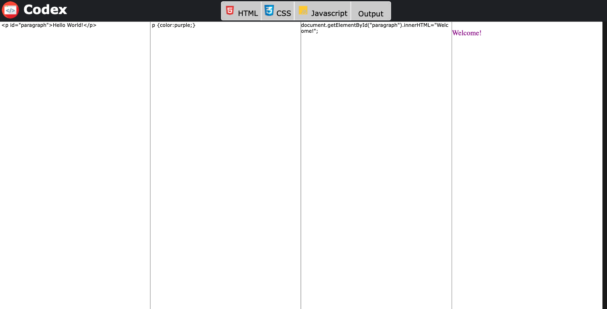

<h1 align="center">
     Codex - A Html/CSS/Javascript Code Tester
</h1>

 

   <a href="#-tecnologias">Technologies</a>&nbsp;&nbsp;&nbsp;|&nbsp;&nbsp;&nbsp;
   <a href="#-projeto">Project</a>&nbsp;&nbsp;&nbsp;&nbsp;&nbsp;&nbsp;
 

 

    
 

 ## :rocket: Technologies

This project was generated with:
- [HTML]
- [CSS]
- [JQuery]

 ## 💻 Project

  Simple code "tester" for HTML, CSS and Javascript developed using JQuery

  Wanna see a live version?  You can check it out here: [Codex](https://douggoncalves.github.io/Codex/).
